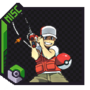

  

    <b>A Cobblemon Addon that overhauls fishing. Allows you to fish up Pokémon varying in rarity and adds a ton of Pokémon items to the loot pool!</b>

    
    

    

 

 

 

 

<h3>
 <strong>
Pokémon
 </strong>
</h3>

Pokémon can be fished up! There are 5 rarities: Very Common, Common, Uncommon, Rare, and Ultra Rare. When you fish them up, you can choose to begin a battle and/or catch them! There are currently 35 implemented Pokémon capable of being fished up, ranging from small Magikarp to huge Wailords!

 

<h3>
 <strong>
Treasures
 </strong>
</h3>

There are 3 rarities of Treasure items: Common, Rare, and Ultra Rare. Fishing Rod enchantments such as Luck of the Sea affect the rarity of items you'll fish up. You can expect to see items such as Exp Candies, Evolutionary Stones, and Poké Balls. Fishing is a great way to get your hands on EV items such as HP Up and Calcium.

 

<h3>
 <strong>
Documentation
 </strong>
</h3>

You can view the implemented Pokémon and Items as well as their rarities <a href="https://docs.google.com/spreadsheets/d/1rHU4d1R2r5en0BGP0OQI99UuManeyo3VpaHw3eyQxsM">here</a>.

 

<h3>
 <strong>
How to Install
 </strong>
</h3>

You must put the downloaded .zip file in BOTH your world's /datapack folder as well as your /resourcepack folder, and enable the resourcepack in-game.

 

 

    
    &nbsp;&nbsp;
    

DanMizu&copy;

